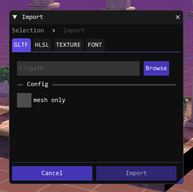
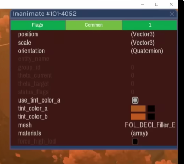
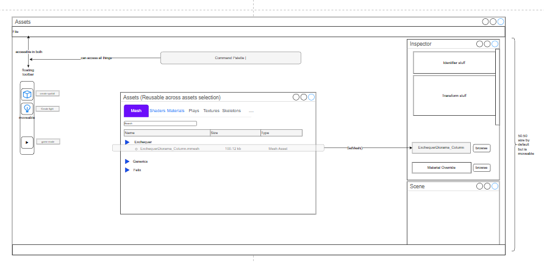

Just finished my importer UI, a seemingly obvious but quite tedious. 
But it feels really good to finally able to give shapes to your ever invisible engine structure.

This week I figured I have to make the import cycle to authoring closed for good.

## Goal
Just focus on what it takes to show something in the world.
What I need to focus on is my own workflow rather than making pretty UI that only I myself uses. 

### Palette / Asset Browser ?
Palette window is practically impossible here, because *Spatials*, *SceneObjects*, etc
have transforms (**Jonathan Blow** calls this **Game Entity**, I'm calling it **Game Object**). 
A little panel where you drag the content into the world and somehow provides you with metadata
to pass to `CreateSpatial()`. However, This is hidden abstraction that gives no value to *Montwig* except trying to please non-existent crowd.

Then in case of asset browser functionality is something that 
file explorer or alternatives like **File Pilot** can easily replace, so we're not going to compete there.
I rather frame it as Asset Picker - minimal version that just list `assets/*` and their sub folders, pretty sure will be useful in inspectors.

lets say I need to add an object to the world. What should i do ?
- ImportGltf using window (resources in)
- File Menu -> Edit -> Create Spatial -> *window opened*
- select mesh dropdown (if got skeleton it will automatically construct the clips from that)
Now this is where inspector comes in. 
I saw *Order Of Sinking Star's* Engine inspector and it did show standard transform stuff with some editable color picker, 
but the part where its refering to resources like material/mesh- are just a text.
Although I'm not sure if that can be changed during run-time or It's something that should be fixed by reimporting the asset.

that said...
There is a case where changing materials during runtime like when we need to make water material (plain plane + water material assignment)
So let's keep this feature open.

In conclusion here's what I'll do : 
- Reframe asset browser as asset picker for resource selection that can be reused in inspector
- Embrace copy-paste / eyedrop tool for entity (gameobjects)
  either make specific *palete.mscn* or just randomly pick from other scenes
  copy to clipboard all the metadata needed (or just uid -> provide duplicate() properties on Object{} class)

there are quite few things in this wireframe, i'll cover each in the future

