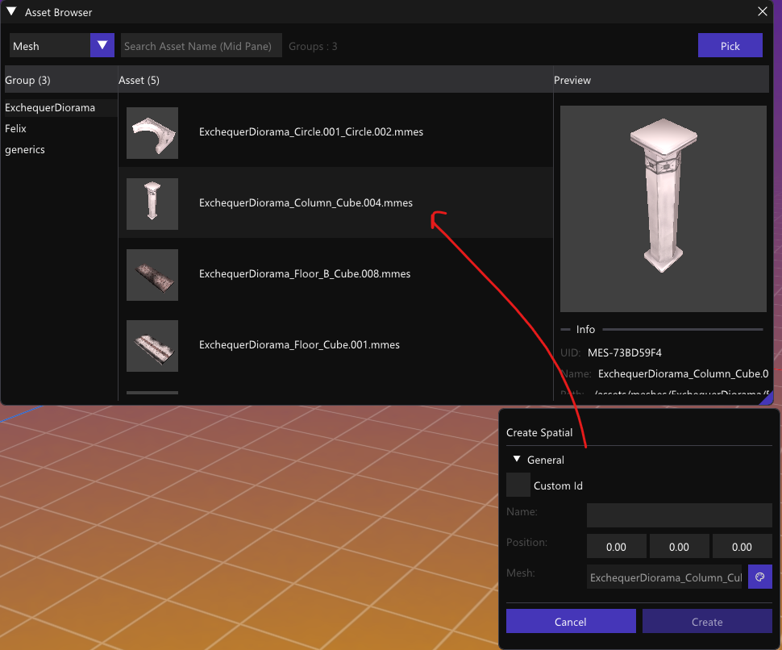

It took a whole week along side my day job to even make minimally working asset browser like this. 

It's far from complete, but the cycle is here. From opening the scenes or inspector, the resource selector widget is now able to inject context and retrieve back what resources that the object is targeting. 

Synchronized across three windows for convenience. Select from one place and carry over to another. 

This made me realized, the editor authoring tool is still very minimal and lacking. More precision is needed before I can have decent level editing in production. I shouldn't try to attain a perfect engine, otherwise it's devoid the point of being customized. At least for my own hand, it needs a reasonable level of comfort.

For the time being I'll stay with this feature longer, more testing is required as this is determine the authoring core loop for the level building. Other types of resources may still waiting to be developed, but not as urgent. 

See you on the next goal post...

