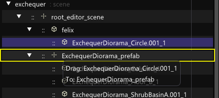
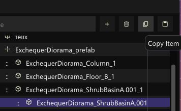
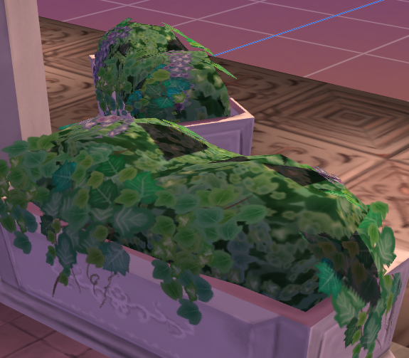

Quick progress update,

## Scene Reparenting

A straightforward node hierarchy editing. You drag the source and drop it on the target of your choice.
Rules are enforced and ensure that it properly propagates.

## Duplication (Copy Paste)

I had to revisit the `clone` and `UID` resolution module here, 
it's now programmed to properly follow incremented suffixes rather than appending *dup* all over.

I planned to have a much intuitive `C-c/C-v` shortcuts for this later on when I arrived at the _command palette_ / console feature.

## Deletion

Detach itself and recursively deletes the children / grandchildren.
How it spreads its roots to other gizmos selection is very tedious to manage
failed many times due to UB. Proper clean up and heap management is important here.

**The Editor journey is still far, It's eating my energy and motivation,
but wish me the best**. 🤺
