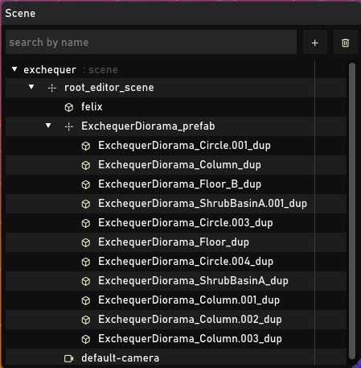
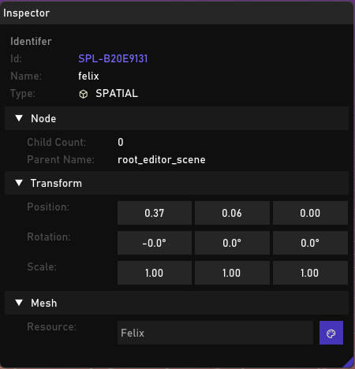
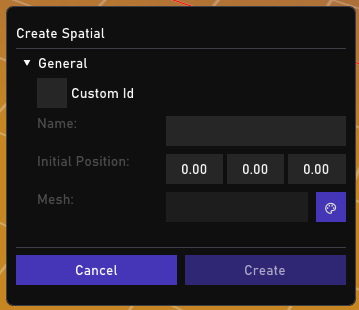

After forging the importer cycle, having scene graph viewer and the inspector should be the natural progression,
Without those two it's hard to author any meaningful levels. As much as I'm tempted to use text based editing,
it's better to invest in UI tool for the sake of scaling convenience and integrity of the data. 

Then there combined with inspector view that's linked with our gizmo picking. 

Feels like a proper engine I dare say :D

The create menus still under progress, but first I need an asset browser / picker. It should be as simple as picking a file path or an UID of the respective resource,
finally pass it to the object factories. 
A proper authoring full cycle would be : 
- loading the scene
- add or delete an object
- save / serialize back to the `.mscn`.

Appear to be simple but lots of work is needed here.
That's all the update for the week. I'll keep posting
