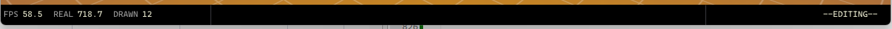
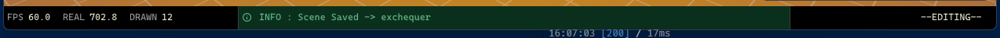
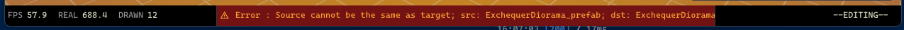
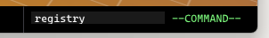

This week is, I've decided to redesign the old status bar that is still lacking function.
It is truly useful feature to place non-distractive information such as fps, file names, or unity like logger.

The region is divided into three section
```
    struct StatusLine {
        ...
        struct{..} region_a; // render stats
        struct{..} region_b; // log
        struct{..} region_c; // cmd
    }
```



### Log Region
It's small and relatively easy to skim, it doesn't distract you but still able to if it wants. For example, on error or standard info, it will flash us with contrasting visuals.



### Command Region
One of the perk of having customized tools-
is that nothing can get in the way of you building 'vim-like' command interface or perhaps our beloved VS/Sublime *command palettes* `ctrl-alt-p` 
(except the spending your night agonizing on how to built it 🥲)


**My Next goal is to make some debug panels for shadow textures or gamepad inputs.**
