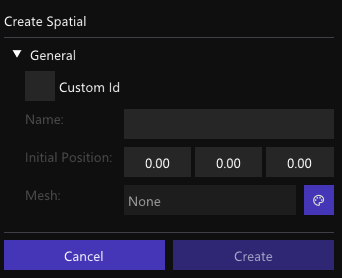
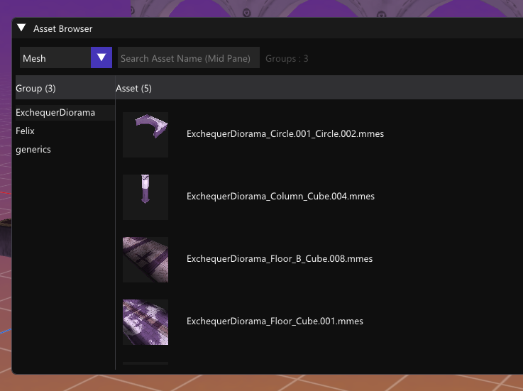

I've been eye-ing on assets browsing capability for a while
and last week scenes and inspectors feature can't be complete without resource edit tool.
You pick a object from the scene graph, inspector showing details, and you want to change the mesh or material perhaps.
Or during creation of scene objects like spatials, you need that unity like resource targeting.



### Making Thumbnails

Thought it's going to be moderately easy, but how wrong can I be ?
Even if your software matured, majority of those are cemented, inflexible components you can't just rely on.

My engine assets are all custom binaries, .mmes, .mmat etc 
it's been conditioned such that the *engine* won't have to second guess the validity of the resource.

Thumbnails therefore should be a straight forward feature.

In **Dear ImGui**, we approach this by:
```
  ImGui::Image(srv, size)
```
Then the question expanded to how do you built srv for that specific object ? 

First with our graphics layer, try to tinker with it for a while and it started to spiraled into endless abstractions lock that you can't break.
The engine at this point is already almost cemented in structure. Dynamics between renderer, graphics and drawables is coupled very tightly.

Tempted to make a pure adhoc solution for this yet it feels like betraying the architectural taste I've set for this engine. 
Alternatively, I tried hard to keep every solution to be contained within each subsystem/modules by relying on C++ function _overloading_ capability.
A life saver it turns out. With that I can simply associated the semantic meaning of the function even if the purpose was slightly off or too specific for the name it given.

For example, rather than polluting the original procedure, just make a new one that accomodates to your need, while still maintaining its naming relevance and ownership.
```
    void RenderDrawable(Drawable * drawable, bool stencil_outline = false);
    void RenderDrawable(Drawable * drawable,
        Graphics::Buffer * rtv,
        Graphics::ViewportOptions vp_id,
        std::array<float, 4> bg_color = {0.1, 0.1, 0.1, 1.0f}
    );
```

_Is this good a approach ? I don't know, but as long as it works, performant and easy to recap, I'm not going to make my life harder._

In the end there is no fast and clean way to solve this (within the engine unique circumstance).
There are just times in engineering reality that you must compromise to make it work.



> Disclaimer: This process was made smoother by **GPT 6 Astra's** help. It rigorously checks my renderdoc capture and informs me with plenty nasty little details that otherwise took days to discover!
